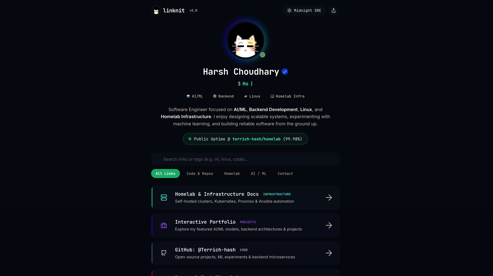

# Linknit

A fast, modern, self-hosted personal link hub built to replace traditional link-in-bio services with complete customization and ownership.

Linknit brings together my portfolio, projects, homelab documentation, technical blog, GitHub repositories, and professional profiles in one clean interface.

---

## Live Demo

**Website**

https://terrich-hash.github.io/linknit/

---

## Preview

<p align="center">

</p>

---

## Why Linknit?

Most link-in-bio platforms are limited in customization and require third-party services.

Linknit is designed to be:

- Fast
- Lightweight
- Self-hosted
- Privacy-friendly
- Fully customizable
- Open Source

---

# Features

- Modern responsive UI
- Dark Mode
- Glassmorphism design
- Smooth animations
- Mobile-friendly
- SEO optimized
- Fully static
- Lightweight
- Self-hosted
- Easy to customize
- Zero backend required

---

# Included Links

Linknit currently includes quick access to:

- Portfolio
- GitHub
- LinkedIn
- Homelab Documentation
- Technical Blog
- AI & Machine Learning Projects
- Backend Projects
- Resume
- Email
- Contact Information

---

# Tech Stack

<p align="center">


</p>

---

# Project Structure

```text
linknit/
│
├── public/
│
├── src/
│   ├── assets/
│   ├── components/
│   ├── styles/
│   ├── data/
│   └── main.js
│
├── index.html
├── package.json
├── vite.config.js
└── README.md
```

---

# Local Development

Clone the repository

```bash
git clone https://github.com/terrich-hash/linknit.git
```

Move into the project

```bash
cd linknit
```

Install dependencies

```bash
npm install
```

Run the development server

```bash
npm run dev
```

Build for production

```bash
npm run build
```

Preview the production build

```bash
npm run preview
```

---

# Deployment

This project is deployed using **GitHub Pages**.

Build

```bash
npm run build
```

Deploy using GitHub Actions.

---

# Customization

Updating your information only requires editing the data and links used throughout the application.

You can customize:

- Name
- Bio
- Social Links
- Portfolio
- Projects
- Theme
- Colors
- Icons
- Animations
- Contact Information

---

# Screens

- Home
- Social Links
- Projects
- Contact
- Footer

---

# Design Goals

The project focuses on:

- Simplicity
- Performance
- Accessibility
- Responsive Design
- Clean UI
- Minimal Dependencies
- Fast Loading

---

# Future Improvements

- Analytics Dashboard
- Visitor Counter
- GitHub API Integration
- Spotify Now Playing
- Dynamic Blog Feed
- Theme Customizer
- QR Code Sharing
- Custom Domain Support
- Multi-language Support

---

# Author

**Harsh Choudhary (Terrich)**

Software Engineer focused on

- Artificial Intelligence
- Machine Learning
- Backend Development
- Linux
- Networking
- Homelab Infrastructure

---

# Connect

## Connect

<p align="center">

<a href="https://terrich-hash.github.io/portfolio_harsh/" target="_blank">

</a>

<a href="https://terrich-hash.github.io/linknit/" target="_blank">

</a>

<a href="https://terrich-hash.github.io/homelab/" target="_blank">

</a>

<a href="https://terrich-hash.github.io/terrich_blog/" target="_blank">

</a>

<a href="https://github.com/terrich-hash" target="_blank">

</a>

<a href="https://www.linkedin.com/in/harsh-choudhary-51b081200/" target="_blank">

</a>

</p>

---

Feel free to fork, customize, and build your own personal hub.
